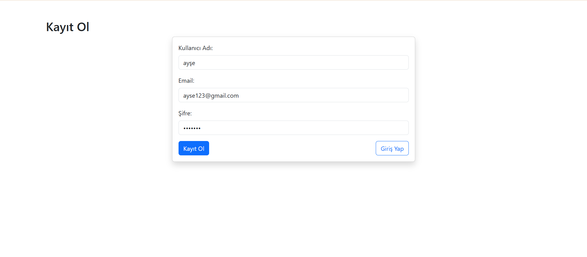
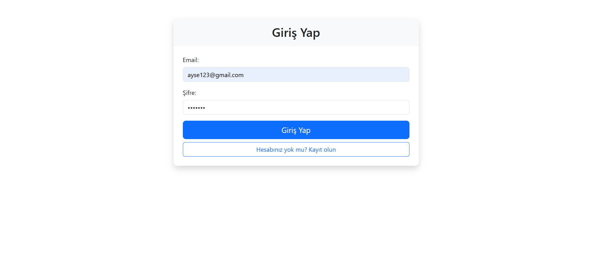
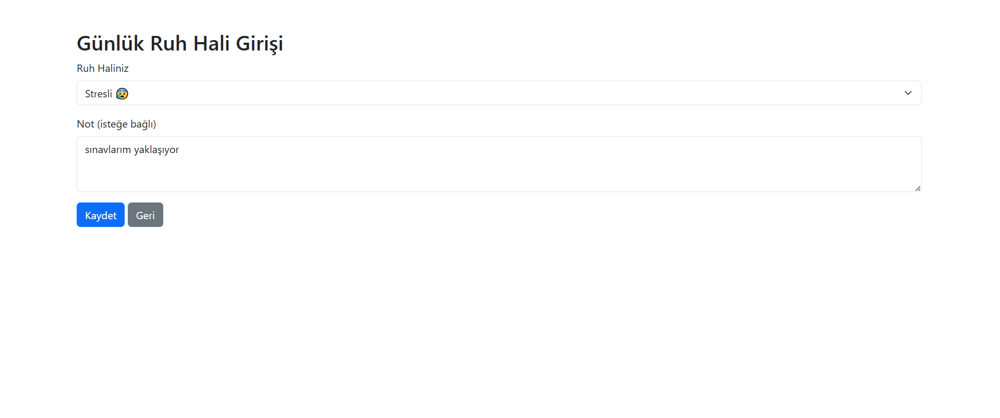
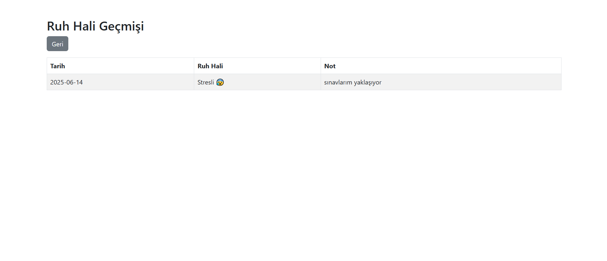
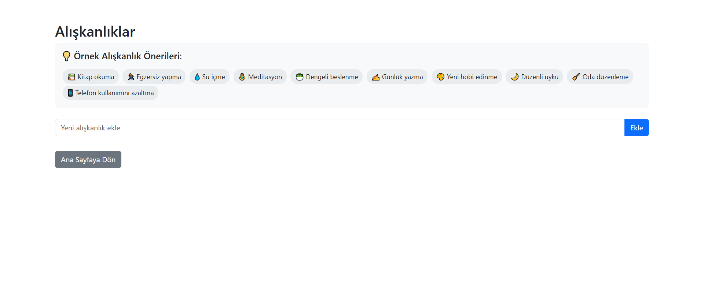
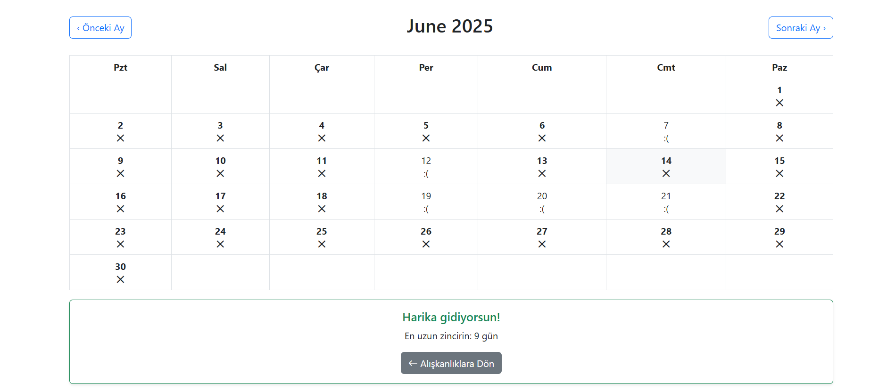

# Günlük Ruh Hali ve Alışkanlık Takip Uygulaması

Bu proje, kullanıcıların günlük ruh hallerini ve alışkanlıklarını takip edebilecekleri, PHP ve MySQL ile geliştirilmiş bir web uygulamasıdır. Kullanıcılar ruh halleriyle ilgili kayıtlar tutabilir, alışkanlıklarını yönetebilir ve gelişimlerini takvim üzerinden takip edebilirler.

## 🚀 Özellikler

- ✅ Kullanıcı kayıt ve giriş sistemi  
- 🔐 Aynı e-posta ile tekrar kayıt engeli  
- 😊 Günlük ruh hali seçimi (emoji + açıklama ile)  
- 🗓️ Ruh hali kayıtlarının tarih bazlı saklanması  
- 🏃‍♂️ Alışkanlık ekleme, güncelleme ve silme  
- 🌱 Hazır önerilen alışkanlıklar (örneğin: egzersiz yapma, su içme)  
- 📅 Takvim görünümünde alışkanlık durumu takibi  
- 🔄 Alışkanlık zinciri oluşturma (❌ yapıldı, :(  yapılmadı)  
- 🥇 En uzun zincir gün sayısı bilgisi  

---

## 💻 Teknik Detaylar ve Kullanılan Teknolojiler

- **Backend:** PHP 
- **Frontend:** HTML, CSS, Bootstrap
- **Veritabanı:** MySQL
- **Veri Güvenliği:** Şifreler `password_hash()` fonksiyonu ile şifrelenmiştir.

---

## 📸 Ekran Görüntüleri

### 📝 Kayıt Olma Ekranı


### 🔑 Giriş Yapma Ekranı


### 🏠 Ana Sayfa


### 😊 Ruh Hali Seçme


### 📊 Ruh Hali Kayıt Tablosu


### ➕ Alışkanlık Ekleme


### 📅 Alışkanlık Takvimi


---

## 📂 Proje Yapısı

````plaintext
mood_tracker/
├── img-mood/
│   ├── 1.png
│   ├── 2.png
│   ├── 3.png
│   ├── 4.png
│   ├── 5.png
│   ├── 6.png
│   └── 7.png
├── add_mood.php
├── dashboard.php
├── database.sql
├── db.php
├── edit_habit.php
├── habit_calendar.php
├── habits.php
├── login.php
├── logout.php
├── mood_list.php
├── register.php
└── toggle_habit.php


## 🔄 Uygulama Akışı

1. Kullanıcı kayıt olur ve giriş yapar.  
2. Dashboard ekranında ruh hali ve alışkanlık bölümleri görünür.  
3. Kullanıcı:  
   - Günlük ruh halini seçip not ekleyebilir.  
   - Takvim üzerinden alışkanlıklarını işaretleyebilir.  
4. Takvimde zincir sistemi çalışır: Her tamamlanan alışkanlık "X" ile temsil edilir.  
5. Kullanıcı, geçmiş kayıtlarını listeleyebilir ve istatistik görebilir. 

